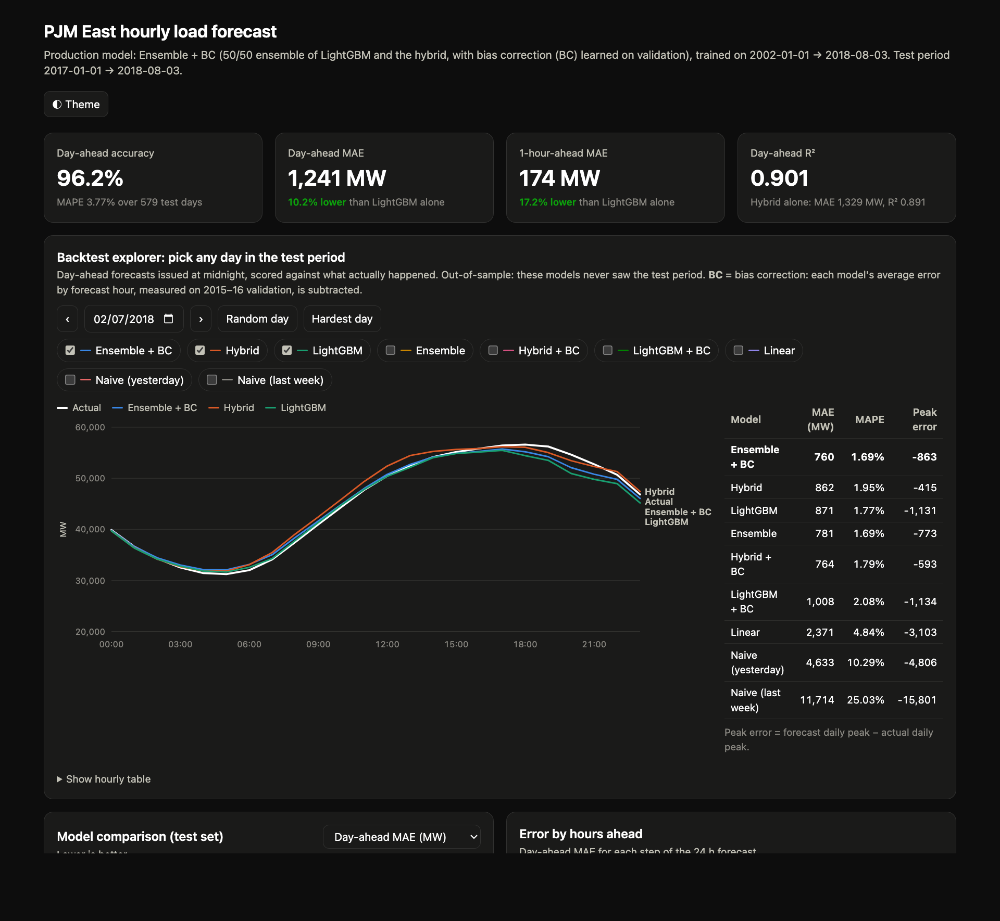

# Hybrid ML: Hourly Electricity Demand Forecasting (PJM East)

[](https://github.com/pankaj-cod/Hybrid_ML/actions/workflows/ci.yml)


Forecasts the next 24 hours of electricity demand for the PJM East grid region from 16 years
of hourly load data. A **hybrid model** (a seasonal linear base with LightGBM learning the
residual) is ensembled with a direct LightGBM model and bias-corrected. It's served as a
FastAPI service with an interactive dashboard, tested, containerised, and CI-checked.

**Live demo:** [pjme-forecast-o84h.onrender.com/dashboard](https://pjme-forecast-o84h.onrender.com/dashboard) · [API docs](https://pjme-forecast-o84h.onrender.com/docs)  
<sub>Free tier: the first visit after ~15 min idle takes 30–60 s to wake up.</sub>



---

## Results

Held-out **test period: 1 Jan 2017 → 3 Aug 2018** (19 months, 579 day-ahead forecasts). It was
never used for training, early stopping or tuning, and was scored once at the end.

| Model | 1-hour-ahead MAE | **Day-ahead MAE** | Day-ahead MAPE | Day-ahead R² |
|---|---|---|---|---|
| Naive (same hour yesterday) | 2,300 MW | 2,300 MW | 7.32 % | 0.738 |
| Linear regression on lags | 386 MW | 2,033 MW | 6.48 % | 0.797 |
| LightGBM (direct) | 210 MW | 1,382 MW | 4.23 % | 0.886 |
| Hybrid (seasonal base + LightGBM residual) | 195 MW | 1,329 MW | 4.08 % | 0.891 |
| Hybrid + bias correction | 182 MW | 1,243 MW | 3.77 % | 0.898 |
| **Ensemble + bias correction (production)** | **174 MW** | **1,241 MW** | **3.77 %** | **0.901** |

- **Day-ahead** = one forecast issued every midnight for the next 24 hours, produced
  recursively (each prediction feeds the next hour's inputs). This is how the model is used,
  so it's the headline metric. 1-hour-ahead scores are shown for reference only.
- Production model: **96.2 % day-ahead accuracy (MAPE 3.77 %)**. It's 10 % more accurate than
  LightGBM alone and 46 % more accurate than naive persistence (by MAE). The median test day has 3.1 % error.
- Remaining error is dominated by sudden weather changes (e.g. a heat wave ending overnight: load fell 31% in one day on 20 May 2017),
  which no load-only model can anticipate. See [Limitations](#limitations-and-next-steps).

---

## The story: fixing a hybrid that lost to a plain tree model

The first version (`notebooks/00_original_exploration.ipynb`) had a hybrid that performed
**worse** than plain LightGBM on test data: MAE ≈ 820 MW vs 232 MW, and later R² < 0.
Diagnosis and fixes:

| Problem found | Fix |
|---|---|
| The residual model predicted `y − trend` but used lags of **raw** `y`, so any trend-extrapolation error passed 1:1 into the forecast | Lags and rolling stats are computed on the **residual** series. A +1,000 MW error injected into the base now moves the forecast by just **16 MW** |
| Multi-scale "trend" targets were identical to existing features (`trend_24` == `rolling_mean_24`) | Replaced with a deterministic seasonal base (known for any future hour) |
| Forecast features froze every lag at the last observed value (train/serve skew) | One shared feature function for training and every recursive step, enforced by a test |
| The "final test" scored a forecast against the **previous** day's actuals | Proper chronological train / validation / test split and a day-ahead backtest |
| Tuned and reported on the same folds; only 1-step-ahead scores | Tuning on validation only; the test set is scored once |

Re-running the original design on the same split gives 1-hour MAE ≈ 500 MW; the fixed hybrid gets 195 MW.

### Squeezing out more accuracy (no new data)

All choices were made on the **2015–16 validation years**:

| Tried (validation day-ahead MAE) | Outcome |
|---|---|
| Extra holidays (Good Friday, Christmas week, NYE) | slightly worse → dropped |
| L1 / Huber loss | no gain → dropped |
| 16-trial hyperparameter search, higher tree cap | within noise → defaults kept |
| **Per-hour bias correction** (learned on 2015, checked on 2016) | −3 % to −6.5 % → **kept** |
| **50/50 LightGBM + hybrid ensemble** | −4 % → **kept** |

Combined, these gave −11 % on validation and **−6.6 % on test** vs the hybrid alone.

---

## How it works

```
y(t) = base(t) + z(t)

base(t)  Ridge regression on deterministic terms: 168 hour-of-week dummies, annual
         Fourier terms (k = 1..3) × hour of day, US federal holidays (+ adjacent days)
         × hour, linear trend. Uses no load data, so it's known for any future hour.
z(t)     LightGBM on calendar features + lags {1,2,3,6,12,24,48,72,168} and rolling
         24 h / 168 h statistics *of z*, plus base(t).

production(t) = 0.5 · LightGBM(t) + 0.5 · hybrid(t) − bias[origin hour, step]

bias     24 × 24 table of mean (forecast − actual) on validation, measured before the
         final refit, so it's out-of-sample.
```

- **Split:** train 2002–2014 · validation 2015–2016 (early stopping, tuning, bias tables) ·
  test 2017–2018. Models are refit on train+val for the test score and on all data for production.
- **Data cleaning:** DST duplicate hours are averaged. Gaps of 6 h or less are
  time-interpolated; longer gaps raise an error instead of being silently filled.
- **Safeguards:** tests assert that features use only past values, that recursive and
  one-step features match exactly, that base drift is absorbed, and that the bias correction
  recovers a planted error pattern. The base model drops annual/trend terms when trained on
  less than 2 years of data.

---

## Quickstart

```bash
git clone https://github.com/pankaj-cod/Hybrid_ML.git && cd Hybrid_ML
uv venv .venv --python 3.12            # or: python3.12 -m venv .venv
uv pip install --python .venv/bin/python -e ".[serve,dev]"
brew install libomp                    # macOS only (OpenMP for LightGBM)
```

| Task | Command |
|---|---|
| **Run the dashboard + API** | `.venv/bin/pjme serve` → open <http://127.0.0.1:8000/dashboard> |
| Forecast the next 24 h after a CSV | `.venv/bin/pjme forecast --history data/raw/PJME_hourly.csv --horizon 24` |
| Retrain + re-evaluate (≈ 8 min) | `.venv/bin/pjme train` |
| Run the tests (26, a few seconds) | `.venv/bin/python -m pytest -q` |

A trained model is included in `artifacts/`, so `serve` and `forecast` work straight after cloning.

### API

| Endpoint | Description |
|---|---|
| `GET /dashboard` | Interactive dashboard |
| `GET /health` | Model info and test metrics |
| `POST /forecast` | Forecast from your own history: `{"history":[{"timestamp":"2018-07-27T01:00","value":31000}, …], "horizon":24}` (≥ 168 hourly points) |
| `GET /forecast/latest?horizon=24` | Forecast after the end of the bundled dataset |
| `GET /api/summary`, `/api/backtest?day=YYYY-MM-DD`, `/api/backtest/daily`, `/api/forecast` | Data behind the dashboard |
| `GET /docs` | Interactive OpenAPI docs |

```python
from pjme_forecast.pipeline import load_bundle
model, meta = load_bundle("artifacts/model.joblib")
model.forecast(history, horizon=24)    # history: hourly pd.Series with >= 168 points
```

---

## Deployment

Docker image + Render blueprint included. Step-by-step: **[docs/DEPLOY_RENDER.md](docs/DEPLOY_RENDER.md)**.
Every push to `main` runs the tests, builds the Docker image, and smoke-tests the running
container in GitHub Actions. Render redeploys automatically.

---

## Project structure

```
config/default.yaml          all settings (split dates, LightGBM params, production model)
data/raw/PJME_hourly.csv     dataset (PJM East hourly load, 2002-2018)
artifacts/                   trained model bundle + evaluation reports
src/pjme_forecast/
  data.py                    load, clean, validate, split
  features.py                calendar/holiday, lag & rolling features, base design matrix
  models.py                  SeasonalBase, RecursiveForecaster (direct/hybrid),
                             EnsembleForecaster, BiasCorrected, naive baselines
  evaluation.py              metrics, 1 h + day-ahead backtests, plots
  pipeline.py                train → evaluate → refit → save
  cli.py                     `pjme train | forecast | serve`
  service.py, dashboard.py   FastAPI app and dashboard endpoints
  static/dashboard.html      dashboard (plain HTML/SVG, no external dependencies)
tests/                       pytest suite on synthetic data
notebooks/                   original exploration (v1) + results notebook
docs/                        deployment guide, images
Dockerfile, render.yaml, .github/workflows/ci.yml
```

---

## Limitations and next steps

- **No weather data.** Temperature drives most of PJM load. Day-ahead error is largest at the
  afternoon peak and in extreme summer/winter months. The hardest test day (20 May 2017, most likely a
  heat wave ending overnight) is missed by every model. **Adding temperature forecasts is the
  biggest improvement available.**
- Point forecasts only. Quantile LightGBM would add prediction intervals.
- The dataset ends in August 2018, so the "live" forecast is a demo. Send recent data to `POST /forecast` for real use.
- Model bundles are pickles (joblib): load only bundles you created, with the pinned library
  versions in `requirements.txt`.

**Tech stack:** Python 3.12 · pandas · scikit-learn · LightGBM · FastAPI · Docker · GitHub Actions · Render
